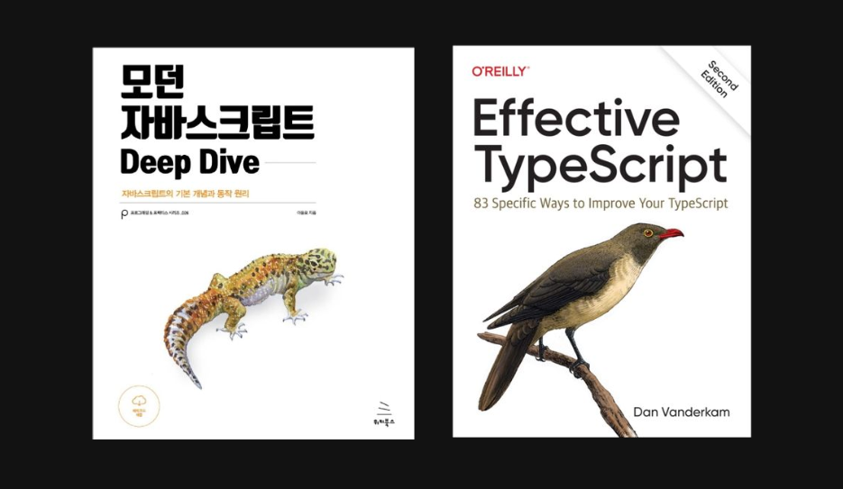

  

# 📚 TIL (Today I Learned)

> 공부하며 정리한 내용을 기록합니다.

**언어에 대한 깊은 이해**를 가장 중요한 기반이라고 생각합니다.
JavaScript와 TypeScript의 동작 원리를 단단히 다지는 것을 최우선에 두고,
그 위에 라이브러리·프레임워크·CS 지식을 쌓아 올리는 방향으로 학습하고 있습니다.

## 🎯 학습 방향

- **언어 (JS / TS)** — 두 권의 기본서를 중심으로 개념을 정독 및 복습하고, 직접 코드로 옮겨가며 체화합니다.
- **라이브러리 & 프레임워크** — 공식 문서와 AI를 활용해 실습 위주로 학습합니다.
- **실습 우선** — 읽고 끝내는 것이 아니라, 작은 예제로 직접 돌려보며 손에 익히는 것을 원칙으로 합니다.

## 🗂️ 디렉터리 구조

| 경로 | 내용 |
|------|------|
| 📂 `code-example/` | 오늘 학습한 내용, JS / TS 학습 중 마주친 개념을 직접 코드로 학습 |
| 📂 `notes/` | 서브 블로그, 프론트엔드 학습 회고 (오픈 준비 및 채워나갈 예정) |
| 📂 `python/` | 코딩테스트 대비 Python 알고리즘 풀이 (백준, 프로그래머스 등) |
| 📂 `SQL/` | SQL 쿼리 연습 (프로그래머스 KIT, 리트코드 등) |
| 📂 `ezilog-posts/` | 메인 블로그(ezilog)에 발행할 회고·정리글 모음 |

## 회고

학습한 내용은 추후 `notes/`에 정리하고,
보다 정제된 핵심 글은 메인 블로그 [ezilog](https://ezilog.vercel.app)에 작성합니다.
